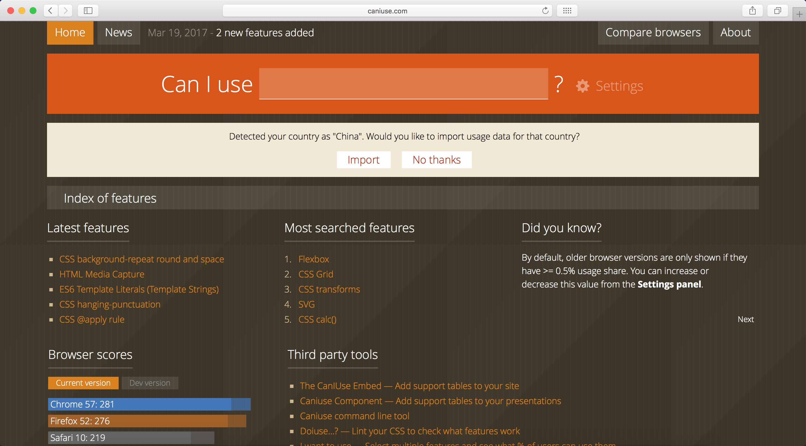
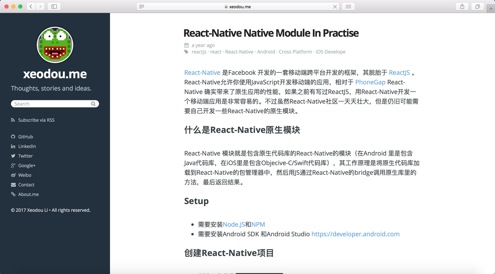
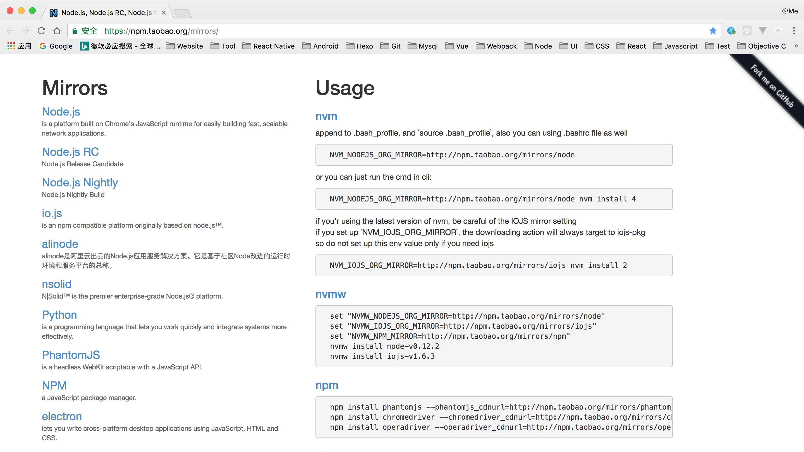
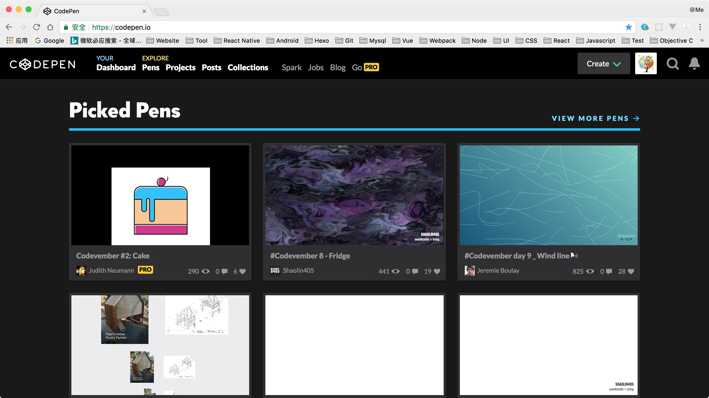
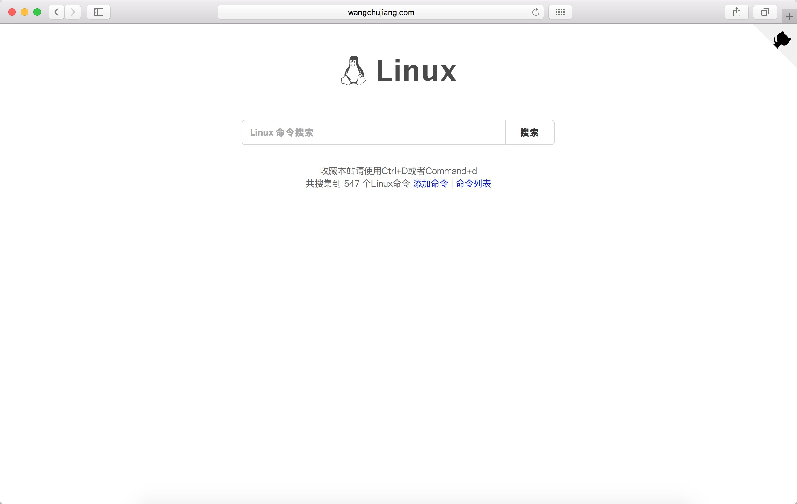
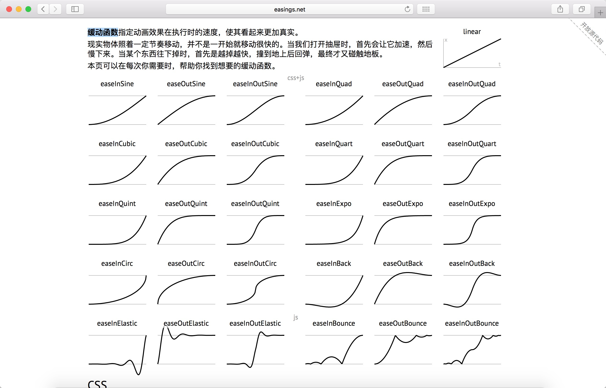
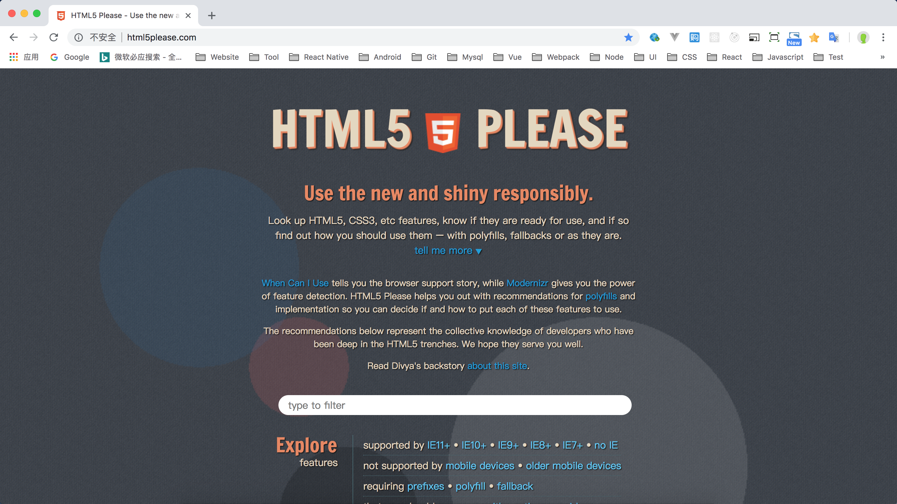
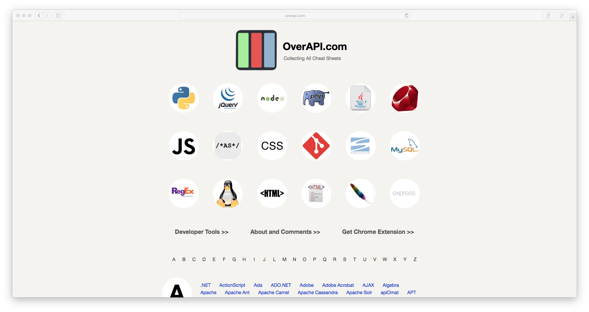
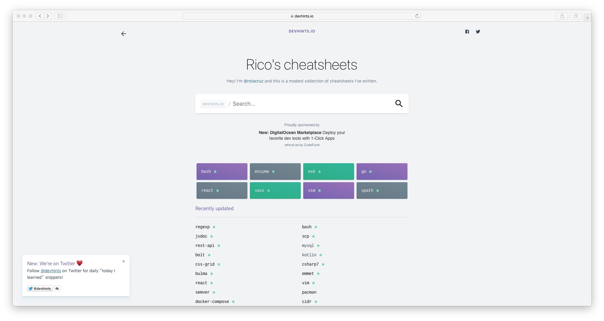

# easy-use

**实用工具、网站收集仓库**

----------

### [Can I Use 浏览器兼容查询](http://caniuse.com/) 
 

### [React/React Native 的ES5 ES6写法对照表](http://reactnative.cn/post/15)  

### [React Native Java项目生成](https://xeodou.me/2015/11/03/write-a-react-native-native-module/)
 

### [NPM 淘宝镜像](https://npm.taobao.org/mirrors/)

### [Codepen 在线代码编辑](https://codepen.io/)

### [Linux命令查询](http://wangchujiang.com/linux-command/)

### [CSS 缓动函数速查表](http://easings.net/zh-cn)

### [HTML5 & CSS3 属性查询](http://html5please.com/)

### [各语言API速查表](http://overapi.com/)

### [各语言属性备忘录](https://devhints.io/)
