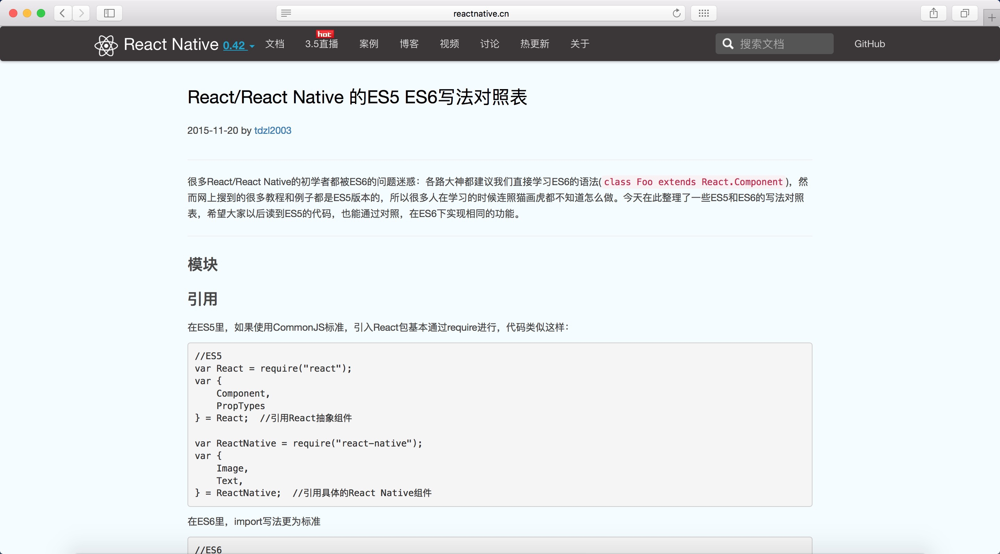

# easy-use

**实用工具、网站收集仓库**

----------

### [Can I Use](http://caniuse.com/) 
查询浏览器兼容的网站（如：CSS样式、JavaScript新属性兼容等...）  
 

### [React/React Native 的ES5 ES6写法对照表](http://reactnative.cn/post/15)  

### [Putting the "Native" in React Native](https://www.promptworks.com/blog/writing-native-modules-for-react-native)
React Native 原生写法介绍  
